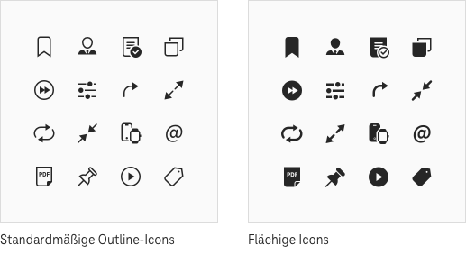
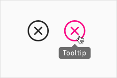

# Icon

Telekom Icons fügen sich harmonisch in das Design unserer Webseiten und Apps ein. Sie helfen, Funktionen schnell zu identifizieren und komplexe oder abstrakte Themen visuell zu veranschaulichen.

## Allgemein

Die Deutsche Telekom hat einen eigenen Icon-Stil, um die Werte der Marke auf eine subtile, aber doch wesentliche Weise zu vermitteln.

### Verwende ein Icon, um

- Nutzer\*innen dabei zu unterstützen, die Kerngedanken von Inhalten und Funktionen schnell zu erfassen und
- die Nutzung unserer Produkte und Dienstleistungen zu vereinfachen und auf wichtige Funktionen oder Inhalte aufmerksam zu machen.

### Verwende Icons besser nicht, wenn

- du sie nur aus rein ästhetischen Gründen einsetzt. Der Zweck eines Icons muss sofort erkennbar sein, um Nutzer\*innen bei der Interaktion mit dem Interface zu unterstützen.

## Varianten

Verwende standardmäßig Outline-Icons für User Interfaces. Sie sind für helle und dunkle Hintergründe optimiert. Flächige Icons heben einen ausgewählten Status hervor.

## Statische und interaktive Icons

Interaktive Icons haben, im Gegensatz zu statischen, eine Funktionalität. Per Klick/Tap lösen Nutzer\*innen eine Aktion aus. Ist ein Icon interaktiv, zeigt die flächige Version den aktiven Zustand an.

## Icons und Labels

Um die beste User Experience zu gewährleisten, versehe die Icons immer mit einem erklärenden Label. Verwende für die Standardfunktionen die fest definierten Icons und Begriffe.
Weitere Informationen zur Rechtschreibung und Terminologie von Telekom Produkten findest du im Glossar unter <a href="https://www.brand-design.telekom.com/en/downloads/glossary/" target="_blank">Glossary</a>.

## Größen

Die Standard-Icons gibt es in den Größen L (48 px), M (24 px) und S (16 px).

Statische Icons

Interaktive Icons

## Barrierefreiheit

### Besonderheit im Code

Wenn alleinstehende Icons in Interfaces relevante Informationen übermitteln, formuliere einen entsprechenden Alternativtext im Code-Property „accessibilityTitle“. So machst du auch blinden Nutzer\*innen alle Informationen zugänglich.

Füge ebenfalls einen Alternativtext hinzu, wenn das Icon keine sichtbare Beschriftung hat (vgl. Schließen-Icon) oder zusätzliche Informationen notwendig sind (z. B. bei externen Links).

Steht das Icon zusammen mit einem aussagekräftigen Text-Label (vgl. Download, Edit, Delete im oberen Beispiel), benötigst du keinen Alternativtext. In diesem Fall dient das Icon nur der visuellen Unterstützung.

## Gestaltung von Icons

Wenn du mehr über die Gestaltung von Telekom Icons erfahren möchtest, lies bitte die Richtlinie <a href="https://www.brand-design.telekom.com/en/articles/i/icons-for-user-interfaces/?updatePreferredLanguage=1" target="_blank">Icons for User Interfaces</a>.

## Verwandte Komponenten

<a href="?path=/usage/components-button--standard">Button</a>
