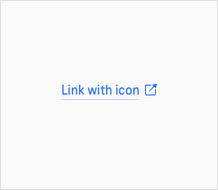

    <h1>Link</h1>
    

Ein Text-Link ist ein interaktives Element, das Nutzer\*innen per Klick/Tap zu einem bestimmten Ort oder Dokument führt.

## Allgemein

Der Text-Link bietet eine zusätzliche Möglichkeit zur Navigation. Er kann als eigenständiges Element oder innerhalb eines größeren Textabschnitts eingesetzt werden. Durch die Farbe und das Schriftformat hebt sich ein Text-Link vom anderen umgebenden Text ab. Verwende ihn nur, wenn er einen wirklichen Nutzen erfüllt – zu viele Links können verwirren.

### Verwende einen Text-Link, um

- Nutzer\*innen an einen anderen Ort weiterzuleiten (innerhalb eines Produkts, Dienstes oder auf eine externe Webseite) oder
- zu einem anderen Abschnitt innerhalb einer Seite zu führen und
- Telefonnummern oder E-Mail-Adressen direkt zugänglich zu machen.

### Verwende Text-Links besser nicht, wenn

- Nutzer\*innen Aktionen ausführen sollen. Nutze in diesem Fall Buttons.

## Varianten

### Link mit Text

Ein reiner Text-Link kann allein, innerhalb eines Satzes oder Textabschnitts sowie im Anschluss eines Texts erscheinen.

### Link mit Text und Icon

Ein Icon kennzeichnet, ob ein Link zu einer externen Webseite, einem Dokument oder Download führt. Wichtig ist, dass du die Icons immer einheitlich verwendest.

### Link ohne Unterstreichung

Wirken die Unterstreichungen im Layout störend, setze den Link ohne Unterstreichung ein. Dies kann zum Beispiel innerhalb von Formularen der Fall sein.

## Best Practices

- Jeder Text-Link muss einzigartig sein, um Probleme mit Screen Readern zu vermeiden.
- Ein Text-Link sollte so kurz wie möglich sein, jedoch lang genug, um den Zweck klar zu vermitteln. Im Optimalfall besteht ein Link aus ein bis drei Wörtern. In Ausnahmefällen kannst du auch einen ganzen Satz verlinken, wenn es sinnvoll ist.
- Setze einen Text-Link nur ein, wenn er selbsterklärend ist und keine weiteren Informationen benötigt. Text-Links wie „Hier klicken" oder „Mehr Informationen" können für Personen, die auf einen Screen Reader angewiesen sind, problematisch sein.

<!--## Größen

Wähle die Schriftgröße auf Basis der verwendeten Schrift im Fließtext.

### Large

20px

### Small

16px

-->

## Verwandte Komponenten

<a href="?path=/usage/components-button--standard">Button</a>
