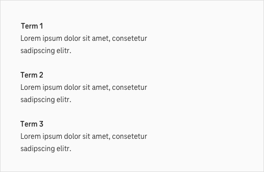

    <h1>Text-List</h1>
    

Eine Liste gliedert zusammengehörige Inhalte in einer vertikalen Struktur. Sie macht es Nutzer\*innen einfacher, die für sie relevanten Informationen zu finden.

## Allgemein

Es gibt drei Arten von Listen: sortierte Listen, Aufzählungslisten und Definitionslisten.

### Nutze eine Liste, um

- große Mengen von Informationen in langen Absätzen zu vermeiden,
- Inhalte hervorzuheben, die sonst im Fließtext untergehen,
- komplizierte Inhalte oder Prozesse Schritt für Schritt zu kommunizieren und
- Begriffe in kurzen Sätzen zu definieren.

### Nutze Listen besser nicht, wenn

- du emotionale Inhalte darstellen möchtest.

## Die drei Listen im Detail

### Sortierte Liste

Die Liste mit Nummerierung eignet sich vor allem für Schritt-für-Schritt-Anleitungen und aufeinanderfolgende Inhalte. Du kannst Unterpunkte einfügen, die eingerückt unter den Hauptpunkten dargestellt werden.

### Aufzählungsliste

Die Elemente dieser Liste sind gleichrangig. Die Liste gibt also keine Reihenfolge vor. Dennoch solltest du die Einträge in einer logischen, für Nutzer\*innen leicht verständlichen Weise organisieren (zum Beispiel alphabetisch oder chronologisch). Auch wenn es keine bestimmte Reihenfolge gibt, kannst du durch Einrücken Hierarchieebenen darstellen.

### Definitionsliste

> Diese Funktion ist bald verfügbar.

Diese Liste beinhaltet Begriffe und darunter die jeweilige Definition.

## Verwandte Komponenten

<a href="?path=/usage/components-table--standard">Table</a>
