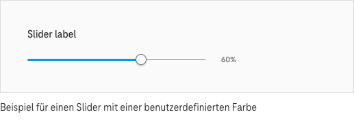
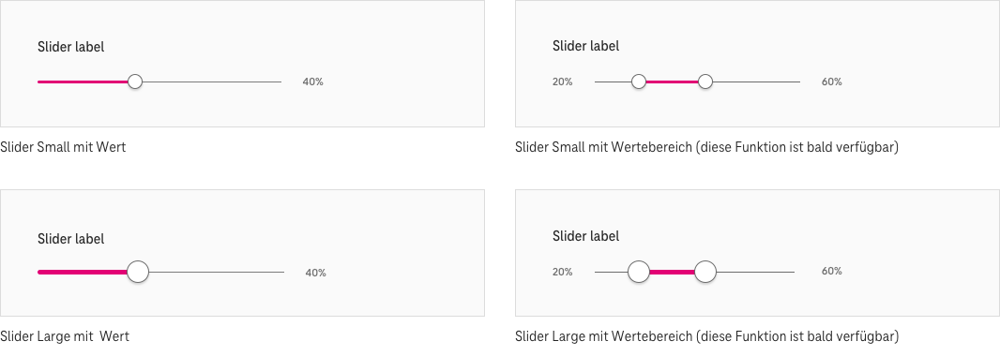

    <h1>Slider</h1>
    

Mit einem Slider können Nutzer\*innen einen Wert oder Wertebereich verändern.

## Allgemein

Der Slider zeigt einen Default-Wert oder -Wertebereich an, den Nutzer\*innen durch Verschieben des Reglers vergrößern oder verkleinern können. In der Regel wird eine sofortige Wirkung ausgelöst, zum Beispiel beim Einstellen der Lautstärke oder beim Filtern von Daten.

### Verwende einen Slider, wenn

- Nutzer\*innen einen Wert oder Wertebereich schnell anpassen möchten oder
- die Anpassung des Wertes oder Wertebereichs eine sofortige Wirkung auslöst und
- die Eingabe nicht präzise sein muss.

### Verwende besser keine Slider, wenn

- Nutzer\*innen einen genauen Wert eingeben möchten (hier ist ein Eingabefeld besser),
- keine unmittelbare Wirkung eintritt,
- der Wertebereich sehr groß ist (z. B. 1-100) oder
- der Wertebereich sehr klein ist (z. B. 1-3).

## Varianten

Jeder Slider benötigt ein Label, das den sich ändernden Wert beschreibt. Zeige den aktuellen Wert immer per Default.

## Farben

Der Slider hat einen Magenta Balken. Möchtest du mit Farbkodierungen arbeiten, kannst du eine Farbe aus der Telekom Farbpalette oder eine eigene Farbe wählen. Achte in jedem Fall darauf, dass die Farbkodierung für Nutzer\*innen verständlich ist und allen Anforderungen der Barrierefreiheit entspricht.

## Größen

## Deaktivierter Zustand

- eine andere Aktion erfolgen muss, bevor der Slider nutzbar ist oder
- die Nutzer\*innen den Wert/Wertebereich aktuell nicht ändern können.

## Verwandte Komponenten

<a href="?path=/usage/components-text-field--standard">Text-Field</a>
