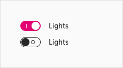

    <h1>Switch</h1>
    

Mit Hilfe eines Switch können Nutzer\*innen eine Option direkt ein- oder ausschalten. Wie ein physischer Lichtschalter liefert der Switch ein sofortiges Ergebnis.

## Allgemein

Ein Switch verfügt über zwei sich gegenseitig ausschließende Zustände (ein/aus oder ja/nein). Er hat immer einen Default-Wert. Der magentafarbene, flächige Switch zeigt an, dass er eingeschaltet ist, während ein Outline-Switch anzeigt, dass er ausgeschaltet ist.

### Verwende einen Switch, wenn

- Nutzer\*innen etwas sofort aktivieren oder deaktivieren möchten, zum Beispiel als Ein-Aus-Schalter oder um Einstellungen vorzunehmen.

### Verwende besser keine Switches, wenn

- die Nutzer\*innen die Änderung über Speichern oder Absenden bestätigen müssen oder
- ein unmittelbares Ergebnis nicht möglich ist (bei beidem eigenen sich Radio-Buttons oder Checkboxen).

## Label

Das Label des Switch sollte kurz und verständlich sein. Für einige Fälle eignet sich ein einzelnes Substantiv am besten.

## Verwandte Komponenten

<a href="?path=/usage/components-checkbox--standard">Checkbox, </a>
<a href="?path=/usage/components-dropdown--standard">Dropdown, </a>
<a href="?path=/usage/components-radio-button--standard">Radio-Button</a>
