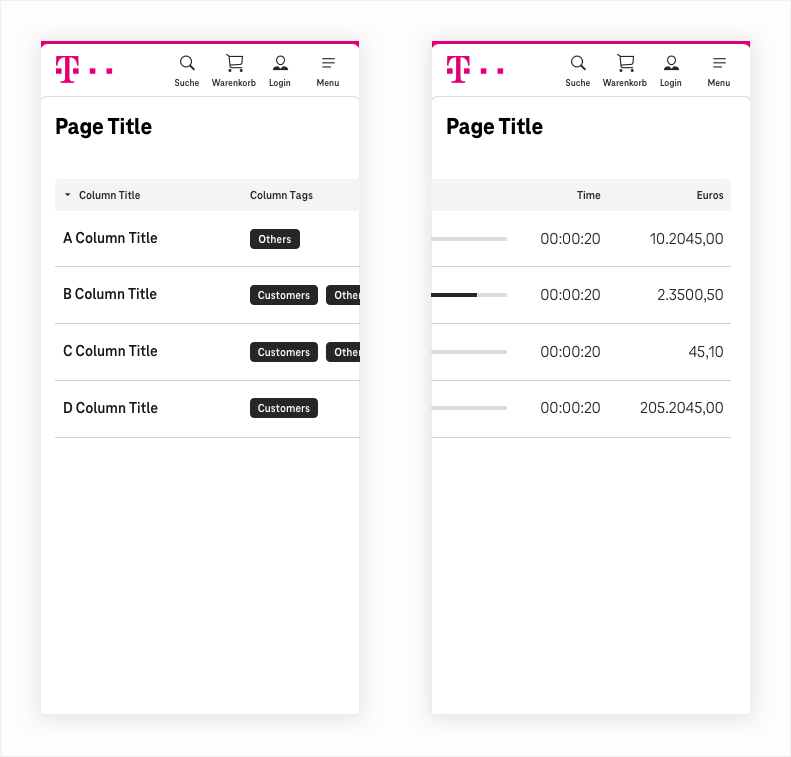

    <h1>Table</h1>
    

Tabellen helfen Nutzer\*innen, Daten leicht zu erfassen und zu vergleichen.

## Allgemein

Eine Tabelle organisiert Daten in Zeilen und Spalten. Zusätzliche Funktionen wie Filtern oder Sortieren bieten zudem die Möglichkeit, die Darstellung an die eigenen Bedürfnisse anzupassen.

### Verwende eine Tabelle, um

- Daten so zu organisieren, dass Nutzer\*innen sie leicht verstehen, analysieren und vergleichen können.

### Verwende Tabellen besser nicht, wenn

- die Komplexität der einzelnen Daten und Funktionen mit einer einfachen Tabelle nicht abbildbar ist oder
- du stattdessen eine Datenvisualisierung zeigen kannst.

## Elemente

### Spalten-Header (1)

Der Titel im Spalten-Header beschreibt den Inhalt der jeweiligen Spalte. Standardmäßig ist der Spalten-Header statisch. Du kannst aber auch die Sortierfunktion verwenden, damit Nutzer\*innen die Inhalte der Spalte nach aufsteigender oder absteigender Reihenfolge sortieren können.

Das Sortier-Icon zeigt an, wenn Nutzer\*innen einen Spalteninhalt bereits sortiert haben.

### Tabellenzeile (2)

Der Inhalt einer Zeile bildet eine Dateneinheit und unterscheidet sich sowohl inhaltlich als auch visuell von den anderen Zeilen.
Die erste Zelle einer Reihe enthält den Titel – eine aussagekräftige Beschreibung des Datensatzes.
Die anderen Zellen können die unterschiedlichsten Arten von Inhalten enthalten. Neben Texten können dies zum Beispiel auch Tags, Progress-Bars oder Funktionen sein.

Für eine Unterstützung der Lesbarkeit können die Zeilen bei Mouseover hervorgehoben werden.

### Trenner (3)

Eine Trennlinie trennt die Tabellenzeilen voneinander.

## Mobil

Die Tabellenstruktur und -darstellung auf mobilen Geräten entspricht der Darstellung auf Desktop-Geräten. Um die gesamte Tabelle zu sehen, können Nutzer\*innen horizontal swipen.

## Best Practices

- Richte den Inhalt der ersten Spalte immer linksbündig aus.
- Je nach Kontext oder Art des Inhalts kannst du den Inhalt der anderen Spalten auch rechtsbündig ausrichten.

## Verwandte Komponenten

<a href="?path=/usage/components-accordion--standard">Accordion, </a>
<a href="?path=/usage/components-list--ordered">List</a>
