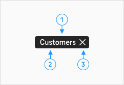
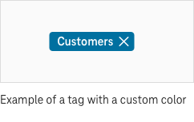

    <h1>Tag</h1>
    

Tags draw the user's attention to certain content elements. They represent a category or an attribute.

## General

Tags consist of relevant keywords in a container. A static tag indicates a category or an attribute; an interactive tag shows things like selected filters, which users can then also remove.

### When to use

Use tags to:

- draw a user's attention to certain elements they might otherwise overlook,
- make it easier for users to recognize content, for instance in tables, or
- show users selected filters.

### When not to use

In general, be careful using tags. Don't use them when:

- users could confuse them with buttons or
- users might not be able to recognize relevant content (particularly if there are too many tags).

## Basic types

### Static tag

A static tag has no interactive function. It only conveys information, for instance a category within a table.

### Interactive tag

An interactive tag offers the possibility to remove the tag by clicking/tapping on the icon. A typical use is, for example, the deactivation of selected filters.

## Elements

### Container (1)

The container contains labels and optionally a close icon.

### Label (2)

Make the label clear and short.

### Icon (3)

By clicking/tapping on the icon, users remove the tag.

## Colors

The default color for tags is dark gray. This way, the maximum contrast guarantees the best legibility.

You can choose your own color for color coding or to achieve a different visual effect. It's important that the color scheme is easily understandable and meets all accessibility requirements.

## Sizes

Scale offers two sizes for tags. Be careful not to combine the two sizes.

### Large

Use large tags as default.

### Small

Only use small tags if you don't have enough space for the standard size.

### Best practices

- Don't mix interactive and static tags within a product or service.
- Decide on one size for your tags.
- Use a clear keyword for the label.
